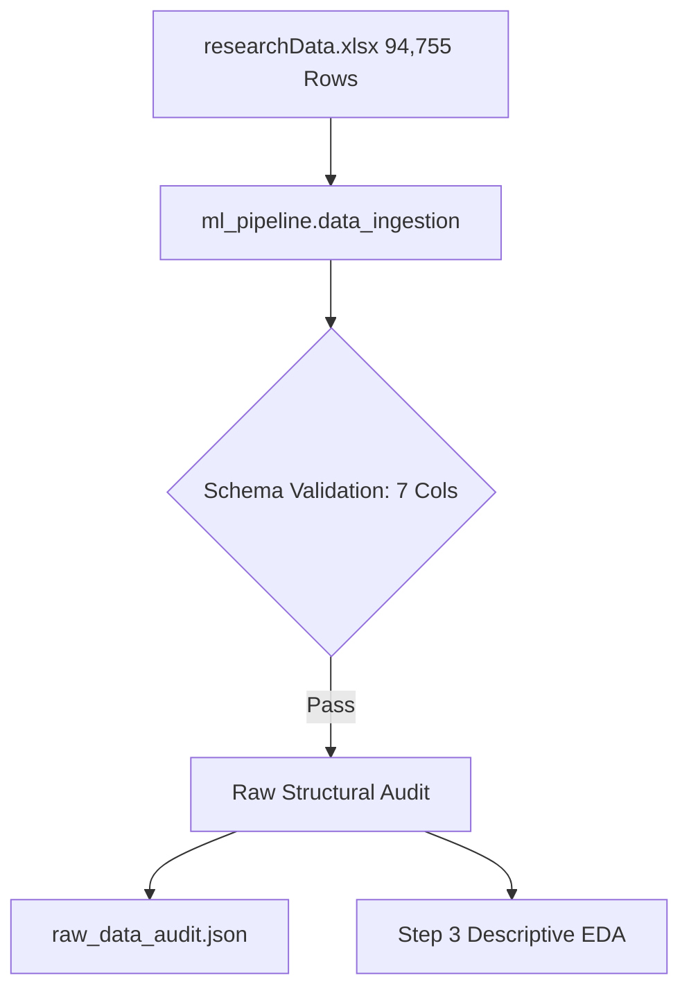

# CropForecastLK: Dataset Dictionary & Attribute Specification
## Department of Census & Statistics — Sri Lanka Highland Crops Dataset
**Module**: Machine Learning Pipeline (Step 2 Deliverable)  
**Assigned Owner**: Sathindu  
**Source File**: `data/raw/researchData.xlsx` (Sheet1)  
**Total Raw Records**: 94,755 rows × 7 features  
**Audit Artifact**: [`data/artifacts/raw_data_audit.json`](file:///d:/Mashing%20Lering%202/Crops-Forecast-LK/CropsForecastLK/data/artifacts/raw_data_audit.json)  

---

## 1. Dataset Overview

The dataset provides official administrative agricultural statistics on non-paddy highland crop cultivation across Sri Lanka collected by the Department of Census and Statistics (DCS). It details cultivated land area (extent) and harvested output (production) across administrative districts, agricultural seasons, and years.



---

## 2. Feature Schema & Field Definitions

| Feature Name | Raw Data Type | Target Domain Type | Description & Semantic Meaning | Unique Values | Sample Values |
| :--- | :--- | :--- | :--- | :--- | :--- |
| **`District`** | `object` (str) | Categorical (Nominal) | Administrative district in Sri Lanka where the crop was cultivated, plus national survey aggregations. | 27 | `"Nuwara Eliya"`, `"Badulla"`, `"Anuradhapura"`, `"National Total"` |
| **`Season`** | `object` (str) | Categorical (Binary + Aggregate) | Agro-climatic cultivation season. `Maha` (NE monsoon), `Yala` (SW monsoon), or `Total` (combined survey row). | 3 | `"Maha"`, `"Yala"`, `"Total"` |
| **`CropCategory`** | `object` (str) | Categorical (Nominal) | Broader classification of field crops. | 11 | `"Cereals"`, `"Pulses"`, `"Roots and Tubers"`, `"Condiments"`, `"Oil Seeds"` |
| **`Crop`** | `object` (str) | Categorical (Nominal) | Specific highland agricultural crop cultivated. | 91 | `"Kurakkan"`, `"Maize"`, `"Green Gram"`, `"Chili"`, `"Potato"`, `"Cassava"` |
| **`Year`** | `object`/`int` | Temporal (Discrete) | Calendar survey year of cultivation and harvest. | 40 | `1990`, `2000`, `2015`, `2023` |
| **`Extent`** | `object` (str) | Continuous (`float64`) | Total land area cultivated for the specific crop, measured in **Hectares (Ha)** or Acres. Stored as comma-formatted string in raw data. | 9,830 | `"650.0"`, `"4,986.0"`, `NaN` |
| **`Production`** | `object` (str) | Continuous (`float64`) | **Primary Target Variable**: Total crop harvest yield obtained, measured in **Metric Tons (MT)**. Stored as comma-formatted string in raw data. | 19,668 | `"422.0"`, `"3,775.0"`, `NaN` |

---

## 3. Structural Audit Findings & Data Quirks

Based on the automated audit executed by [`ml_pipeline.data_ingestion`](file:///d:/Mashing%20Lering%202/Crops-Forecast-LK/CropsForecastLK/ml_pipeline/data_ingestion.py):

### 3.1 String-Formatted Numbers with Commas
- **Extent**: 7,146 rows contain comma thousand-separators (e.g., `"4,986.0"`).
- **Production**: 21,915 rows contain comma thousand-separators (e.g., `"21,915.0"`).
- *Implication*: Standard numerical parsing fails without custom regex sanitization (`str.replace(',', '')`). Handled in Lahiru's Step 5.

### 3.2 Aggregate Summary Rows Embedded in Survey Data
- **38,701 records (40.8% of total raw dataset)** represent national total rows (`District == "National Total"`) or annual combined totals (`Season == "Total"`).
- *Implication*: If retained, these aggregate rows would cause severe double-counting and data contamination. Must be isolated during cleaning.

### 3.3 Missing Values (Nulls)
- **Extent**: 16,644 missing values (17.57%).
- **Production**: 17,016 missing values (17.96%).
- *Implication*: Missingness stems from non-cultivation in certain districts or reporting delays. Median groupwise imputation required in Prashan's Step 6.

### 3.4 Zero-Extent Anomalies
- **292 records** have recorded `Extent == 0` while `Production > 0`.
- *Implication*: Physical impossibility in agricultural science; flags home-garden or unreported land area. Handled in Step 6.

---

## 4. Verification & Audit Execution

The ingestion and audit pipeline can be verified at any time using:
```powershell
python -m ml_pipeline.data_ingestion
```
Output results are persisted to [`data/artifacts/raw_data_audit.json`](file:///d:/Mashing%20Lering%202/Crops-Forecast-LK/CropsForecastLK/data/artifacts/raw_data_audit.json).
