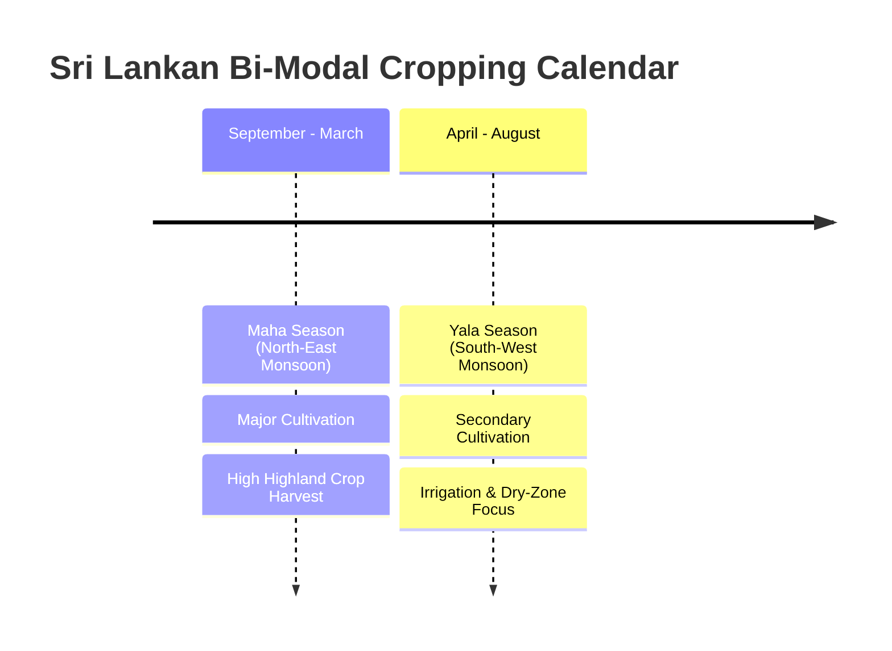

# CropForecastLK: Problem Definition & Domain Framing
## Sri Lanka Highland Crops Production Forecasting System
**Module**: Machine Learning Pipeline Foundation (Step 1)  
**Assigned Owner**: Sathindu (Team Member)  
**Academic Module**: Machine Learning Development & Full-Stack Application  
**Repository**: [CropsForecastLK](https://github.com/prashan7070/CropsForecastLK)  
**Branch**: `feature/data-ingestion-eda`  

---

## 1. Executive Summary & Agricultural Context

Sri Lanka's agricultural economy relies heavily on both paddy (rice) and non-paddy highland field crops. Highland crops—comprising cereals (e.g., Kurakkan, Maize), pulses (e.g., Green Gram, Black Gram, Cowpea), condiments (e.g., Chili, Big Onion, Red Onion, Ginger, Turmeric), and root tubers (e.g., Potato, Sweet Potato, Cassava)—form the cornerstone of rural farmer livelihoods, daily nutritional intake, and national food security.

However, highland crop cultivation in Sri Lanka suffers from severe seasonal production volatility. Because production decisions are decentralized and lack predictive intelligence, Sri Lankan markets frequently oscillate between acute crop shortages (triggering exorbitant consumer retail prices and emergency imports) and sudden overproduction gluts (causing catastrophic post-harvest farmgate price collapses, storage spoilage, and farmer debt crises).

**CropForecastLK** is designed to provide an automated, data-driven machine learning forecasting pipeline that accurately projects seasonal harvest yields across Sri Lanka's administrative districts, equipping agricultural planners, agrarian service centers, and farmers with actionable intelligence prior to harvest.

---

## 2. Supervised Machine Learning Task Formulation

The forecasting challenge is formally defined as a **supervised non-linear tabular regression problem**.

### 2.1 Mathematical Formulation
Given an observational feature vector $\mathbf{x}_i \in \mathcal{X}$ representing agricultural and geographic factors for a specific district, season, and crop:

$$\mathbf{x}_i = \left[ \text{District}_i, \text{Season}_i, \text{CropCategory}_i, \text{Crop}_i, \text{Year}_i, \text{Extent}_i \right]$$

The primary objective is to learn a mapping function $f: \mathcal{X} \rightarrow \mathbb{R}^+$ parameterized by $\mathbf{\theta}$ that minimizes an expected loss function $\mathcal{L}$ between actual harvest $y_i$ and predicted harvest $\hat{y}_i$:

$$\hat{y}_i = f(\mathbf{x}_i; \mathbf{\theta})$$

$$\min_{\mathbf{\theta}} \frac{1}{N} \sum_{i=1}^{N} \mathcal{L}(y_i, \hat{y}_i) + \Omega(\mathbf{\theta})$$

Where $\Omega(\mathbf{\theta})$ denotes regularization penalties to prevent model overfitting.

### 2.2 Target Variables
1. **Primary Target Variable ($y_{\text{primary}}$)**:
   - **`Production`**: Total crop harvest output measured in **Metric Tons (MT)**.
   - *Operational Purpose*: Informs national food balance sheets, import/export quotas, and regional transport logistics.
2. **Secondary Target Variable ($y_{\text{secondary}}$)**:
   - **`Crop_Yield`**: Agricultural land productivity ratio measured in **Metric Tons per Hectare (MT/Ha)**:
     $$\text{Crop\_Yield} = \frac{\text{Production (MT)}}{\text{Extent (Hectares)}}$$
   - *Operational Purpose*: Evaluates farming efficiency independent of total land area, identifying high-efficiency agro-ecological pockets.

---

## 3. Sri Lankan Agro-Climatic Dynamics: Yala vs. Maha

Agriculture in Sri Lanka is governed by two distinct monsoon-driven cropping seasons:

### 3.1 Maha Season (North-East Monsoon)
- **Duration**: Typically begins in September/October with land preparation and extends through harvest in February/March.
- **Climatic Characteristics**: Driven by the North-East Monsoon, bringing widespread precipitation across the Dry and Intermediate zones (e.g., Anuradhapura, Polonnaruwa, Ampara, Moneragala, Badulla).
- **Agricultural Impact**: Constitutes the primary production season. A substantial portion of rainfed highland crops (such as Maize, Kurakkan, and Green Gram) are planted during Maha, resulting in significantly higher aggregate cultivated extent and harvest volumes.

### 3.2 Yala Season (South-West Monsoon)
- **Duration**: Commences in April/May and concludes with harvest in August/September.
- **Climatic Characteristics**: Dominated by the South-West Monsoon, delivering abundant rainfall to the wet zone and central highlands (e.g., Nuwara Eliya, Kandy, Matale), while the northern and eastern dry zones remain largely arid.
- **Agricultural Impact**: Represents the minor cultivation season. Highland crop extent in dry zones is constrained to minor irrigation schemes, river basins, and groundwater agro-wells. Yields are highly sensitive to mid-season drought.

---

## 4. Highland Crop Categorization & Domain Scope

The dataset provided by Sri Lanka's Department of Census and Statistics encompasses 6 major agricultural crop categories:

| Category | Key Highland Crops | Primary Cultivation Districts | Agro-Climatic Sensitivity |
| :--- | :--- | :--- | :--- |
| **Cereals (Non-Paddy)** | Kurakkan (Finger Millet), Maize | Anuradhapura, Moneragala, Badulla, Ampara | Drought tolerant; vital for animal feed & local flour |
| **Pulses** | Green Gram (Mung Bean), Black Gram, Cowpea | Hambantota, Kurunegala, Anuradhapura, Moneragala | Nitrogen-fixing short-duration crops; high protein source |
| **Roots & Tubers** | Potato, Sweet Potato, Cassava, Innala | Nuwara Eliya, Badulla, Kandy, Galle, Ratnapura | High yield per hectare; sensitive to soil moisture and blight |
| **Condiments** | Red Onion, Big Onion, Chili, Ginger, Turmeric | Jaffna, Matale (Dambulla), Anuradhapura, Kurunegala | High economic value; extreme price volatility in urban markets |
| **Oil Seeds** | Groundnut, Sesame (Gingelly) | Moneragala, Vavuniya, Hambantota, Mullaitivu | Thrives in well-drained sandy loam soil under sunny conditions |

---

## 5. Scope, Business Objectives & Value Proposition

### 5.1 Business & Policy Objectives
1. **Accurate Regional Pre-Harvest Estimation**: Enable the Department of Agriculture to project national production volumes 60–90 days prior to major harvests.
2. **Mitigation of Post-Harvest Price Crashes**: Alert agrarian market operators at major hubs (e.g., Dambulla Economic Centre, Keppetipola) to imminent regional supply gluts, allowing timely cold-storage allocation and food-processing diversion.
3. **Targeted Import Policy Formulation**: Replace ad-hoc import licensing with predictive intelligence, avoiding unwarranted tariff reductions during peak domestic harvest windows (e.g., Big Onion and Potato harvesting periods).
4. **Data-Driven Farmer Advisory**: Provide district-level productivity insights to guide farmers toward optimal crop selection during seasonal pre-cultivation planning meetings (*Kanna Kanna Rasweem*).

### 5.2 Technical Challenges Addressed in Foundational Steps
- **High Skewness & Extreme Variance**: Agricultural production ranges from smallholder plots (<1 MT) to massive multi-thousand MT commercial maize extents.
- **Dirty String Numbers**: Raw census records format thousands with commas (e.g., `"3,663.0"`) or string null indicators (`"n.a."`, `"-"`).
- **Aggregate Row Contamination**: Official survey tables embed summary rows (`"National Total"`, `"Island Total"`) alongside district-level records, necessitating automated identification and cleansing.

---

## 6. Step 1 Ownership Verification & Handoff Criteria

- [x] Supervised regression problem formally formulated with primary (`Production`) and secondary (`Crop_Yield`) targets.
- [x] Sri Lankan agro-climatic dynamics (Yala vs. Maha monsoonal cycles) contextualized.
- [x] Highland crop categories and domain boundaries established.
- [x] Configuration constants centralized in [`ml_pipeline/config.py`](file:///d:/Mashing%20Lering%202/Crops-Forecast-LK/CropsForecastLK/ml_pipeline/config.py).
- [x] Direct handoff ready for **Step 2 (Automated Data Ingestion & Schema Audit)**.
