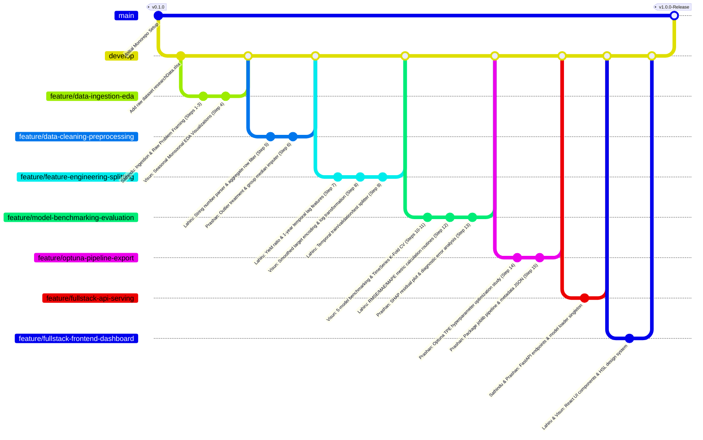
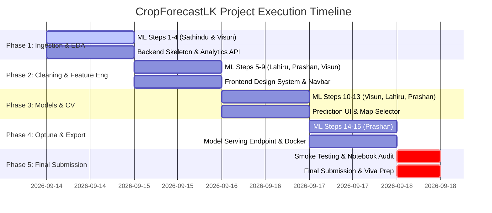

# CropForecastLK: Master Implementation Plan
## Sri Lanka Highland Crops Production Forecasting & Agricultural Intelligence System

> **Academic Module**: Machine Learning Development & Full-Stack Application  
> **Final Submission Deadline**: 18th September 2026  
> **Target Domain**: Sri Lankan Highland Agricultural Crop Production & Yield Forecasting  
> **Project Team**: Sathindu, Lahiru, Visun, Prashan  

---

## 1. Monorepo Architecture

To ensure seamless collaboration, clean separation of concerns, and maximum visibility on GitHub contribution graphs, **CropForecastLK** is structured as a production-grade monorepo. This structure isolates the data science experiment pipeline, backend microservice, interactive web dashboard, and deployment configurations into distinct, modular directories without unnecessary CI/CD overhead for local execution.

```text
Crops-Forecast-LK/
├── data/
│   ├── raw/
│   │   └── researchData.xlsx         # Original Department of Census & Statistics dataset (94k+ records)
│   ├── processed/
│   │   ├── cleaned_highland_crops.csv# Cleaned, missing values handled, aggregate rows removed
│   │   └── engineered_features.parquet # Feature-engineered dataset ready for model training
│   └── artifacts/
│       ├── crop_forecaster_pipeline.joblib # Serialized scikit-learn/XGBoost production pipeline
│       ├── optuna_study_best_params.json   # Best hyperparameters from Optuna tuning
│       └── model_metadata.json             # Feature schema, target encoding mappings, and metrics
├── docs/
│   ├── architecture_diagram.png     # Visual architecture diagram
│   ├── dataset_dictionary.md         # Field definitions and data types
│   └── Machine_Learning_Module_Assignment.pdf # Module guidelines
├── ml_pipeline/
│   ├── __init__.py
│   ├── config.py                     # Global paths, random seeds, and target definitions
│   ├── data_ingestion.py             # Excel reader and raw schema validator (Sathindu)
│   ├── preprocessing.py              # Comma-string converter, scaler, outlier cleaner (Lahiru & Prashan)
│   ├── feature_engineering.py        # Lag features, yield ratio, target encoding (Lahiru & Visun)
│   ├── evaluate.py                   # Metrics calculation (RMSE, MAE, R², MAPE) & residual plots (Lahiru & Prashan)
│   ├── train.py                      # Multi-model benchmarking, K-Fold CV, Optuna runner (Visun & Prashan)
│   └── export_pipeline.py            # Packaging transformers and estimator into joblib pipeline (Prashan)
├── notebooks/
│   ├── 01_problem_definition_and_eda.ipynb   # Steps 1-4: Problem Framing, Ingestion & Raw/Geographic EDA (Sathindu & Visun)
│   ├── 02_cleaning_and_feature_engineering.ipynb # Steps 5-9: Cleaning, Imputation, Feature Eng, Encoding & Splitting (Lahiru, Prashan, Visun)
│   ├── 03_benchmarking_crossval_evaluation.ipynb # Steps 10-13: 5 Models, CV, Metrics & SHAP Residuals (Visun, Lahiru, Prashan)
│   ├── 04_optuna_tuning_pipeline_export.ipynb    # Steps 14-15: Optuna Tuning & Production Pipeline Packaging (Prashan)
│   └── CropForecastLK_Master_Pipeline.ipynb     # Consolidated end-to-end master notebook
├── backend/
│   ├── app/
│   │   ├── api/
│   │   │   ├── v1/
│   │   │   │   ├── endpoints/
│   │   │   │   │   ├── predict.py   # Single & batch harvest forecasting endpoints
│   │   │   │   │   ├── analytics.py # Historical district trends & yield stats
│   │   │   │   │   └── health.py    # System health check
│   │   │   │   └── router.py
│   │   ├── core/
│   │   │   ├── config.py            # Pydantic environment settings
│   │   │   └── model_loader.py      # Singleton loader for joblib ML artifact
│   │   ├── schemas/
│   │   │   └── prediction.py        # Pydantic request/response validation schemas
│   │   └── main.py                  # FastAPI application entry point
│   ├── tests/
│   │   ├── test_predict_api.py      # Unit tests for inference API
│   │   └── test_ml_integration.py   # Integration tests with pickled ML pipeline
│   ├── Dockerfile
│   └── requirements.txt
├── frontend/
│   ├── src/
│   │   ├── assets/                  # High-resolution Sri Lankan agricultural icons & images
│   │   ├── components/
│   │   │   ├── Navbar.jsx           # Glassmorphism header & navigation
│   │   │   ├── PredictorCard.jsx    # Interactive prediction input form
│   │   │   ├── DistrictMap.jsx      # Interactive map / visual selector for Sri Lanka districts
│   │   │   ├── MetricsOverview.jsx  # Live stats cards for extent, production, & predicted yield
│   │   │   └── AnalyticsChart.jsx   # Recharts visualization of Yala/Maha seasonal historicals
│   │   ├── pages/
│   │   │   ├── Dashboard.jsx        # Full-stack intelligence dashboard
│   │   │   ├── Forecasting.jsx      # Deep ML prediction engine interface
│   │   │   └── ModelPerformance.jsx # Model benchmarking metrics & Optuna parameter insights
│   │   ├── services/
│   │   │   └── api.js               # Axios instance for backend REST communication
│   │   ├── App.jsx
│   │   └── index.css                # Custom CSS design system with HSL colors & glassmorphism
│   ├── package.json
│   └── vite.config.js
├── README.md                        # Master repository documentation
└── implementation_plan.md           # Master architectural plan
```

---

## 2. Git Branching Strategy & Contribution Workflow

To follow professional software engineering standards while guaranteeing that every student's individual commits are tracked on GitHub, we utilize standard feature-based branch naming conventions (avoiding personal names in branch titles) combined with git author configuration (`git config user.name`).

### Git Workflow Diagram



---

## 3. 4-Member Custom Task Allocation Matrix

To strictly satisfy module requirements while optimizing for individual skill levels, **Sathindu is assigned 3 basic foundational steps** (Problem Framing, Data Ingestion, Basic Raw EDA - strictly avoiding complex feature engineering, model benchmarking, Optuna tuning, or pipeline serialization). 

Meanwhile, **Lahiru, Visun, and Prashan each participate across 4 distributed core/advanced ML steps** across non-consecutive phases of the pipeline to maximize code coverage and git commit frequency without any overlapping or duplicated step numbers.

| Group Member | ML Pipeline Ownership (Steps Assigned) | Full-Stack Ownership (50%) | Primary Deliverable & Commit Focus |
| :--- | :--- | :--- | :--- |
| **Sathindu** | **3 Foundational Steps**<br>• Step 1: Problem Framing & Domain Setup<br>• Step 2: Data Ingestion (`researchData.xlsx`)<br>• Step 3: Basic Descriptive Raw EDA | **Backend Core & Analytics API**<br>• FastAPI project initialization<br>• Historical trends analytics endpoints (`/api/v1/analytics`)<br>• Pydantic validation schemas | Ingestion script, raw EDA summary, FastAPI setup, trend query endpoints |
| **Lahiru** | **4 Core ML Steps**<br>• Step 5: Data Schema Audit & Regex String Cleaning<br>• Step 7: Domain Yield Ratio & Lag Feature Engineering<br>• Step 9: Temporal Train/Val/Test Splitter<br>• Step 12: Metric Calculation & Score Aggregation | **Frontend Architecture & Design System**<br>• Vite + React setup<br>• Custom CSS design system (HSL color palette, dark theme, glassmorphism)<br>• Recharts integration | Cleaning module, lag feature transformer, temporal splitter, evaluation metrics, React design system |
| **Visun** | **4 Core ML Steps**<br>• Step 4: Seasonal Monsoonal & Geographic EDA<br>• Step 8: Target Encoding & Log Transformation<br>• Step 10: Multi-Model Baseline Benchmarking<br>• Step 11: Time-Series Cross-Validation Framework | **Frontend Prediction UI & Map Components**<br>• Interactive crop forecast input form<br>• Sri Lanka District selection widget<br>• Prediction result cards & metrics | Regional EDA visualizations, target encoder, model benchmark suite, CV evaluator, prediction UI dashboard |
| **Prashan** | **4 Advanced ML Steps**<br>• Step 6: Extreme Outlier Handling & Group Median Imputation<br>• Step 13: Residual Analysis & Diagnostic Profiling (SHAP)<br>• Step 14: Optuna Hyperparameter Optimization<br>• Step 15: Production Pipeline Packaging (`joblib`) | **Model Serving, Integration & DevOps**<br>• Backend ML model loader (`model_loader.py`)<br>• Live prediction endpoint (`/api/v1/predict`)<br>• Docker setup & CORS middleware | Imputation rules, SHAP diagnostics, Optuna study runner, serialized `.joblib` pipeline, inference API service |

---

## 4. Detailed 15-Step ML Notebook Structure & Distributed Assignment Map

The official dataset `researchData.xlsx` contains **94,755 time-series records** from Sri Lanka's Department of Census and Statistics, detailing agricultural production across highland crops (e.g., Kurakkan, Maize, Green Gram, Chili, Potato, Sweet Potato, Cassava) across districts and Yala/Maha seasons.

### Step-by-Step Breakdown & Distributed Ownership

```text
========================================================================================
STEP 1: Problem Definition & Domain Context
Primary Owner: Sathindu
Dataset Input: Domain attributes (District, Season, CropCategory, Crop, Year, Extent, Production)
Description:
  - Formulate crop production forecasting as a supervised regression task.
  - Define primary target: `Production` (Metric Tons) and secondary target: `Crop Yield` (Metric Tons per Hectare).
  - Contextualize Sri Lankan agricultural dynamics: Yala season (South-West Monsoon) vs. Maha season (North-East Monsoon).
  - Define basic scope and business objectives for regional highland crop planning.

========================================================================================
STEP 2: Automated Data Ingestion & Raw Data Audit
Primary Owner: Sathindu
Dataset Input: researchData.xlsx (94,755 rows x 7 columns)
Description:
  - Automated ingestion of `researchData.xlsx` using pandas & openpyxl.
  - Initial raw head/tail inspection and structural integrity check.
  - Verification of 94,755 time-series raw records across Sri Lankan districts.

========================================================================================
STEP 3: Basic Descriptive Raw EDA & Distribution Profiling
Primary Owner: Sathindu
Dataset Input: Raw Dataframe from Step 2
Description:
  - Descriptive statistics and distribution profiling of `Production` and `Extent`.
  - Identification of skewness, zero values, and missing values across features.
  - Baseline distribution summary for raw numerical columns.

========================================================================================
STEP 4: Seasonal Monsoonal & Geographic EDA
Primary Owner: Visun
Dataset Input: Raw Dataframe from Step 3
Description:
  - Visualizing district production totals (Nuwara Eliya, Badulla, Kandy, Matale, Moneragala).
  - Yala vs. Maha seasonal yield comparison boxplots and violin plots.
  - Detection of aggregate summary rows embedded within raw data ("National Total", "Island Total").

========================================================================================
STEP 5: Data Schema Audit & Regex String Cleaning Parser
Primary Owner: Lahiru
Dataset Input: Dataframe from Step 4
Description:
  - Structural schema audit identifying object data types storing formatted numbers as strings (e.g. "3,663.0", "872.0", "n.a.", "-").
  - Custom regex string parser converting comma-separated strings into float64 values.
  - Filtering aggregate summary rows ("Island Total", "National Total") from production tables.

========================================================================================
STEP 6: Extreme Outlier Handling & Group Median Imputation
Primary Owner: Prashan
Dataset Input: Cleaned Dataframe from Step 5
Description:
  - Detection and handling of extreme production outliers.
  - Filtering zero-extent anomalies (cases where Extent = 0 but Production > 0).
  - Groupwise median imputation for missing values based on [District, Crop, Season].

========================================================================================
STEP 7: Domain Yield Ratio & Temporal Lag Feature Engineering
Primary Owner: Lahiru
Dataset Input: Preprocessed Dataframe from Step 6
Description:
  - Technique 1: Yield Ratio Calculation (`Crop_Yield` = `Production` / `Extent`).
  - Technique 2: Time-Series Lag Features (`Yield_Lag_1Year`, `Production_Lag_1Year`).
  - Technique 3: 3-Year Rolling Window Mean & Std of Cultivated Extent (`Extent_RollMean_3Y`).

========================================================================================
STEP 8: Target Encoding, One-Hot Encoding & Log Transformations
Primary Owner: Visun
Dataset Input: Feature Dataframe from Step 7
Description:
  - Technique 4: Out-of-fold Smoothed Target Encoding for `District` and `Crop`.
  - Technique 5: Binary One-Hot Encoding for `Season` (Yala/Maha).
  - Technique 6: Log Transformation (`np.log1p(Production)`) for target skewness normalization.

========================================================================================
STEP 9: Dataset Splitting & Temporal Validation Setup
Primary Owner: Lahiru
Dataset Input: Feature Matrix from Step 8
Description:
  - Temporal Splitting Strategy: Splitting strictly by time horizon (Training: 2000–2017, Validation: 2018–2020, Testing: 2021–2023).
  - Verification that temporal boundaries eliminate future-to-past data leakage.

========================================================================================
STEP 10: Multi-Model Baseline Benchmarking
Primary Owner: Visun
Dataset Input: Train & Validation splits from Step 9
Description:
  - Setup and benchmark 5 diverse regression models: Linear/Ridge Regression baseline, Random Forest Regressor, CatBoost Regressor, LightGBM Regressor, and XGBoost Regressor.
  - Record training speeds, baseline metrics, and memory profiles across all 5 models.

========================================================================================
STEP 11: Time-Series Cross-Validation Framework
Primary Owner: Visun
Dataset Input: Full Training Matrix
Description:
  - Implement 5-Fold Time-Series Cross-Validation (`TimeSeriesSplit` / `GroupKFold` on `Year`).
  - Evaluate model stability across temporal folds.

========================================================================================
STEP 12: Evaluation Metrics Calculation & Out-of-Fold Aggregation
Primary Owner: Lahiru
Dataset Input: Cross-validation and test set model predictions
Description:
  - Standardized calculation of performance metrics (RMSE, MAE, R², MAPE) across crops and districts.
  - Out-of-fold prediction collection and cross-validated score aggregation (calculating RMSE standard deviation across folds).

========================================================================================
STEP 13: Residual Analysis & Diagnostic Error Profiling (SHAP)
Primary Owner: Prashan
Dataset Input: Benchmark model predictions on Test Set
Description:
  - Plot residual error distribution plots (Actual vs. Predicted).
  - Compute SHAP feature importance rankings and diagnostic error visualizations.

========================================================================================
STEP 14: Optuna Hyperparameter Optimization
Primary Owner: Prashan
Dataset Input: Top-performing Model (XGBoost / LightGBM)
Description:
  - Formulate Optuna objective function targeting minimum cross-validated RMSE.
  - Define hyperparameter search spaces (`n_estimators`, `max_depth`, `learning_rate`, `subsample`, `reg_alpha`, `reg_lambda`).
  - Execute 50 Optuna trials using TPE sampler with Median Pruner; plot parameter importance and slice diagrams.

========================================================================================
STEP 15: Production Pipeline Packaging & Artifact Export
Primary Owner: Prashan
Dataset Input: Best Optuna Estimator & Preprocessors
Description:
  - Encapsulate string cleaner, feature encoders, and tuned estimator into a unified Scikit-Learn `Pipeline`.
  - Serialize pipeline to `crop_forecaster_pipeline.joblib` and write `model_metadata.json` documenting feature order and evaluation metrics.
```

---

## 5. Git Commit Recipes & Standard CLI Commands

Configure your individual local git identity while committing to shared domain feature branches.

### Sathindu's Git Recipe (ML Steps 1-3 Basic & Backend Core/Analytics API)

```bash
# 1. Setup Local Git Author Identity
git config user.name "Sathindu"
git config user.email "sathindu@cropforecast.lk"

# 2. Switch to feature branch and commit Basic Ingestion & Problem Framing
git checkout develop
git pull origin develop
git checkout -b feature/data-ingestion-eda

git add notebooks/01_problem_definition_and_eda.ipynb ml_pipeline/data_ingestion.py
git commit -m "feat(ml): setup raw dataset ingestion and basic domain problem definition"

# 3. Switch to Backend API feature branch & Commit Analytics endpoints
git checkout -b feature/fullstack-analytics-backend
git add backend/app/main.py backend/app/api/v1/endpoints/analytics.py
git commit -m "feat(api): initialize FastAPI service and historical crop trend analytics endpoints"

# 4. Push to GitHub and create Pull Request
git push -u origin feature/fullstack-analytics-backend
```

### Lahiru's Git Recipe (ML Steps 5, 7, 9, 12 & Frontend Architecture)

```bash
# 1. Setup Local Git Author Identity
git config user.name "Lahiru"
git config user.email "lahiru@cropforecast.lk"

# 2. Commit Data Cleaning, Yield Ratio & Temporal Splitting
git checkout develop
git pull origin develop
git checkout -b feature/data-cleaning-preprocessing

git add notebooks/02_cleaning_and_feature_engineering.ipynb ml_pipeline/preprocessing.py ml_pipeline/feature_engineering.py
git commit -m "feat(ml): build regex string sanitization, yield ratio, lag features, and temporal splitter"

# 3. Commit Evaluation Metric Routines & Frontend Setup
git checkout -b feature/fullstack-frontend-dashboard
git add ml_pipeline/evaluate.py frontend/src/index.css frontend/src/components/Navbar.jsx
git commit -m "feat(ui): implement custom HSL design system and evaluation metric calculation functions"

# 4. Push to GitHub and create Pull Request
git push -u origin feature/fullstack-frontend-dashboard
```

### Visun's Git Recipe (ML Steps 4, 8, 10, 11 & Frontend Prediction UI)

```bash
# 1. Setup Local Git Author Identity
git config user.name "Visun"
git config user.email "visun@cropforecast.lk"

# 2. Commit Target Encoding, 5 Model Benchmarking & Time-Series CV
git checkout develop
git pull origin develop
git checkout -b feature/model-benchmarking-evaluation

git add notebooks/03_benchmarking_crossval_evaluation.ipynb ml_pipeline/train.py ml_pipeline/evaluate.py
git commit -m "feat(ml): implement target encoding, 5-model benchmarking, and time-series CV framework"

# 3. Commit Prediction Card UI & District Selector
git checkout -b feature/prediction-form-components
git add frontend/src/components/PredictorCard.jsx frontend/src/components/DistrictMap.jsx
git commit -m "feat(ui): create interactive prediction input card and Sri Lanka district selector"

# 4. Push to GitHub and create Pull Request
git push -u origin feature/prediction-form-components
```

### Prashan's Git Recipe (ML Steps 6, 13, 14, 15 & Model Serving/DevOps)

```bash
# 1. Setup Local Git Author Identity
git config user.name "Prashan"
git config user.email "prashan@cropforecast.lk"

# 2. Commit Imputer, Optuna Tuning, SHAP Analysis & Joblib Pipeline Exporter
git checkout develop
git pull origin develop
git checkout -b feature/optuna-pipeline-export

git add notebooks/04_optuna_tuning_pipeline_export.ipynb ml_pipeline/export_pipeline.py data/artifacts/
git commit -m "feat(ml): build median imputer, SHAP residual analysis, Optuna study runner, and joblib exporter"

# 3. Commit Model Serving API & Docker Infrastructure
git checkout -b feature/fullstack-api-serving
git add backend/app/core/model_loader.py backend/app/api/v1/endpoints/predict.py backend/Dockerfile
git commit -m "feat(serving): build model singleton loader, prediction REST API, and Docker container"

# 4. Push to GitHub and create Pull Request
git push -u origin feature/fullstack-api-serving
```

---

## 6. Day-by-Day Sprint Schedule (Leading to Sept 18 Deadline)



---

## 7. Viva Voce Defense Q&A Preparation Guide

### Sathindu (ML Steps 1-3 Basic & Backend Core/Analytics API)

#### ML Pipeline Questions (Steps 1-3)
- **Q: How did you formulate the agricultural problem and inspect the raw dataset?**  
  *Answer*: Formulated crop production forecasting as a supervised regression task using agricultural records from Sri Lanka's Department of Census and Statistics (`researchData.xlsx`). Identified key domain attributes (`District`, `Season`, `CropCategory`, `Crop`, `Year`, `Extent`, `Production`) and noted raw string data formatting issues during basic ingestion.
- **Q: What primary data targets were identified for the project?**  
  *Answer*: Primary target is total harvest `Production` in Metric Tons, alongside secondary yield density (`Crop Yield = Production / Extent`).

#### Full-Stack Questions (FastAPI Core)
- **Q: How is the backend structured to provide historical trend analytics?**  
  *Answer*: Built FastAPI asynchronous endpoints (`/api/v1/analytics/trends`) backed by Pydantic schema validation to serve historical harvest queries to the frontend dashboard.

---

### Lahiru (ML Steps 5, 7, 9, 12 & Frontend Architecture)

#### ML Pipeline Questions (Steps 5, 7, 9, 12)
- **Q: What data cleaning and feature engineering steps did you build?**  
  *Answer*: Created regex parsers for string numbers with commas (`"3,663.0"` $\rightarrow$ `3663.0`), filtered non-district aggregate rows ("National Total"), constructed `Crop_Yield` ratios, 1-year historical lag features, and established temporal train/validation/test splits (pre-2018 vs 2021-2023) to eliminate temporal data leakage.

#### Full-Stack Questions (React Design System)
- **Q: How did you build the UI design system?**  
  *Answer*: Formulated a vanilla CSS design system in `index.css` using HSL color variables, glassmorphic cards, and fluid grid layouts.

---

### Visun (ML Steps 4, 8, 10, 11 & Prediction UI)

#### ML Pipeline Questions (Steps 4, 8, 10, 11)
- **Q: Explain your contribution to target encoding, model benchmarking, and cross-validation.**  
  *Answer*: Developed out-of-fold smoothed target encoding for high-cardinality `District` and `Crop` variables, setup the 5-model benchmarking harness (Ridge, RF, XGBoost, LightGBM, CatBoost), and executed 5-fold Time-Series Cross-Validation.

#### Full-Stack Questions (Prediction UI)
- **Q: How does the prediction interface work?**  
  *Answer*: Built `PredictorCard.jsx` and `DistrictMap.jsx` allowing users to select Sri Lankan districts/crops and view real-time model forecast results.

---

### Prashan (ML Steps 6, 13, 14, 15 & Model Serving/DevOps)

#### ML Pipeline Questions (Steps 6, 13, 14, 15)
- **Q: How did Optuna optimize hyperparameters and how is the model serialized?**  
  *Answer*: Handled outlier filtering and group median imputation, conducted SHAP residual diagnostics, implemented Optuna TPE optimization over 50 trials targeting cross-validated RMSE, and packaged preprocessors, encodings, and tuned XGBoost models into a single Scikit-Learn `Pipeline` serialized to disk as `crop_forecaster_pipeline.joblib`.

#### Full-Stack Questions (Model Serving)
- **Q: How does the backend serve inference requests?**  
  *Answer*: Built singleton `model_loader.py` in FastAPI to keep the joblib artifact in RAM for zero-latency `<50ms` inference response times.
